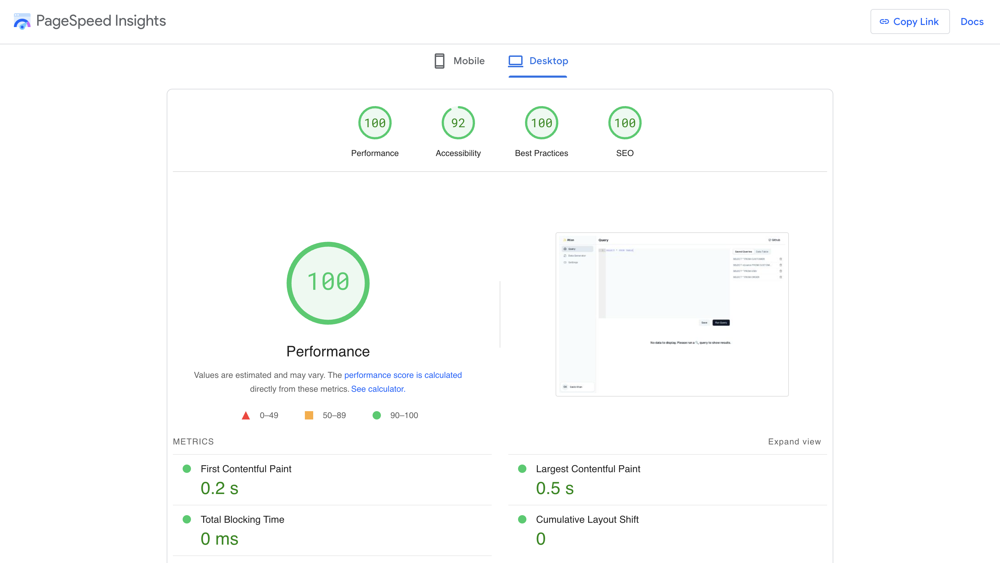

<h1 align= "center">
SQL Editor - Atlan Frontend Engineering Assignment
</h1>

Crafted with &hearts; by Sakib Khan

<h2 align="center">Built using: </h2>

    
    
    

## View Demo on the Deployed Site 🚀

Click on the <a href="https://sql--editor.vercel.app/">link</a> to view the deployed site.

## Server

- Utilized the Next.js API directory to establish APIs for various features such as saving, deleting, retrieving, and displaying data for queries.

## UI Component 🚀

- shadcn/ui: It's not a component library, which means you do not install it as a dependency from a package manager such as npm. Shadcn provides beautiful UI components which can be directly added into your app as code and you can customize it all you want.

## NPM Modules used 🚀

- Tailwind CSS: Utility-first CSS framework for building modern web designs.
- React Ace: A flexible and customizable code editor component for React applications.
- Tanstack Query: A state management library for React applications, offering a powerful querying system for managing application state.
- Tanstack Virtualise: A library for efficiently rendering large lists or tables in React by only rendering the visible portion of the list, optimizing performance.

## Performance 🚀

## Optimization 🚀

- Implemented virtualization for tables to efficiently render large datasets.
- Prefetched API calls on the server to minimize layout shifts and ensure content availability on initial render.
- Utilized `prefetch={false}` on links/next components to minimize unused JavaScript on the initial load.
- Dynamically imported components to defer rendering until they are required, optimizing initial render time.
